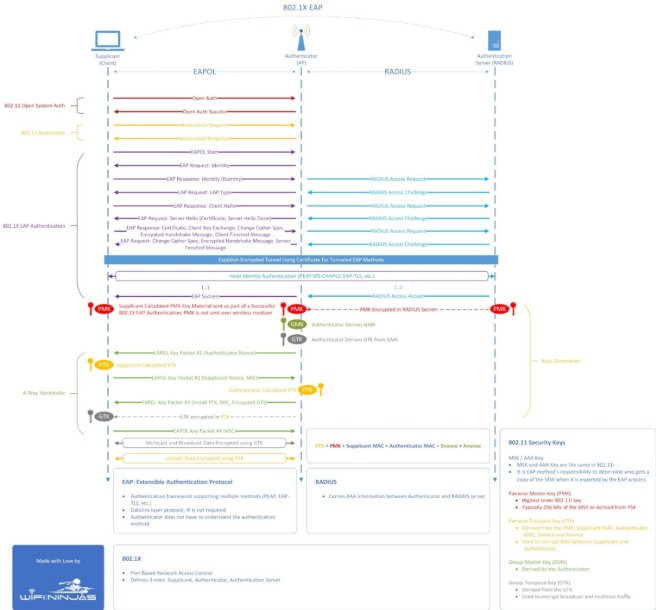

Cisco ISE NAC Configuration

**Cisco ISE**, **Meraki**, **Intune**, and mixed **Centralised/Distributed** wireless models. 

**1. ISE Configuration – 802.1X Policies, Profiling, Segmentation, Posture**

**ISE Services:**

- Enable: **802.1X Authentication**, **Profiling**, **Posture Assessment**, **TrustSec Segmentation**

**a) Authentication Policy**

IF Wireless\_802.1X AND EAP-TLS

`   `THEN Use Identity Source: Active Directory

ELSE IF Wireless\_802.1X AND PEAP-MSCHAPv2

`   `THEN Use Identity Source: Active Directory

ELSE IF MAB

`   `THEN Use Internal Endpoints Database

**b) Authorization Policy**

IF AD-Group = "Corp-Users" AND EAP-TLS

`   `THEN PermitAccess, VLAN 10, DACL:PermitAll, TrustSec\_SGT:Corp

IF AD-Group = "BYOD-Users" AND PEAP-MSCHAPv2 AND Posture = Compliant

`   `THEN PermitAccess, VLAN 20, DACL:InternetOnly, TrustSec\_SGT:BYOD

IF AD-Group = "BYOD-Users" AND Posture = Non-Compliant

`   `THEN Quarantine VLAN, DACL:DenyAll

IF EndpointProfile = "IoT-Device"

`   `THEN PermitAccess, VLAN 40, DACL:Restricted

IF Wireless SSID = "GUEST"

`   `THEN GuestFlow via Captive Portal, VLAN 30

**c) Profiling & Posture**

- Enable DHCP, RADIUS, and HTTP Profiling probes
- Define profiles for:
  - Windows/macOS
  - iOS/Android
  - IoT Cameras, Printers
- Enable posture checks (AV status, disk encryption, OS compliance) via AnyConnect/NAC agent

**2. RADIUS Server Settings**

**a) Meraki Dashboard → RADIUS Configuration:**

RADIUS Server:

`  `Name: ISE-Cluster-1

`  `IP: 10.0.10.10

`  `Port: 1812

`  `Secret: <shared\_secret>

`  `NAS ID: CORP-WiFi

RADIUS Accounting:

`  `Port: 1813

- Configure the same for **BYOD** and **GUEST** SSIDs.
- Ensure **RADIUS CoA** is enabled on Meraki for posture rechecks or role changes.

**3. Certificate Requirements**

**a) Internal PKI (or 3rd-party):**

- Issue client certs via Intune/SCEP or GPO
- Root CA trusted by ISE and all supplicants

**b) Certificate Templates:**

- **Client Authentication**: with CN = hostname, SAN = UPN/email
- **ISE Server Certificate**: CN = ise.company.com (wildcard or SAN-based for clusters)

**c) EAP-TLS:**

- Mandatory for CORP-WiFi
- Verify certs using CRL or OCSP
- Enable **certificate-based machine and user auth**

**4. Active Directory Configuration**

**a) Organizational Units & Groups:**

- OU=Corporate Devices
- OU=BYOD Devices
- OU=IoT
- OU=GuestUsers

**b) AD Groups (used in ISE Policies):**

- Corp-Users
- BYOD-Users
- ISE-Admins

**c) Group Policy for Cert Enrollment (if not using Intune):**

- Auto-enroll via GPO for machine + user certs
- Push WLAN profile with SSID = CORP-WiFi, auth = EAP-TLS

**5. Intune Configuration for Device Compliance**

**a) Intune Configuration:**

- **SCEP Connector** to issue certs to enrolled devices
- **Compliance Policies**:
  - Require BitLocker/FileVault
  - Require AV
  - Minimum OS version
- **Conditional Access**: Integration with Azure AD & ISE via Intune connector

**b) Device Tagging for ISE:**

- Devices marked as compliant via Intune can be tagged in ISE as Compliant=True
- Used in **Authorization policy** for BYOD VLAN 20 or quarantine fallback

**6. AP Network Architecture: Centralised & Distributed Models**

**a) Centralised Architecture (e.g., University/Enterprise Campus)**

- **Topology**: MR APs → Campus Core → ISE → AD/Intune → Internet
- **Roaming**: Enable 802.11r/k/v
- **L3 Roaming**: Set up Mobility Anchors (Catalyst/Cisco/Meraki config)
- **DHCP & DNS**: Centralized DHCP with option 82
- **QoS**:
  - WMM Voice profile on voice SSIDs
  - DSCP to Queue Mapping on Catalyst switches
- **VLANs**: All VLANs trunked across campus and available to APs/controllers

**b) Distributed Architecture (e.g., Retail Sites)**

- **Topology**: MR APs → Cloud → RADIUS Proxy (e.g., Portnox, SecureW2)
- **Authentication**:
  - Use EAP-TLS or PSK + RADIUS-based MAC auth
  - Local breakout (no central tunnel)
- **Cloud PKI/NAC**: SecureW2 or Cloud ISE Lite
- **VLANs**:
  - Local VLANs per SSID: 10 (Corp), 20 (BYOD), 30 (Guest), 40 (IoT)
- **Group Policies**:
  - Apply Meraki Group Policies based on RADIUS attributes (e.g., Filter-ID)

Meraki Dashboard for SSID settings, RADIUS server integration, and access policies, tailored to the enterprise NAC environment. 

**1. Meraki SSID Configuration**

To set up your SSIDs with appropriate authentication methods:

**a. CORP-WiFi (802.1X with EAP-TLS)**

1. Navigate to **Wireless > Configure > Access control**.
1. Select the **CORP-WiFi** SSID.
1. Under **Network access**, choose **Enterprise with my RADIUS server**.
1. In the **RADIUS servers** section:
   1. Click **Add a server**.
   1. Enter the RADIUS server's IP address, port (default is 1812), and the shared secret.
1. Under **Advanced settings**:
   1. Set **WPA encryption mode** to **WPA2 only** or **WPA3** as per your security requirements.
   1. Enable **802.11r** for fast roaming.
   1. Configure VLAN tagging if dynamic VLAN assignment is used.

**b. BYOD-Secure (802.1X with PEAP-MSCHAPv2)**

1. Navigate to **Wireless > Configure > Access control**.
1. Select the **BYOD-Secure** SSID.
1. Under **Network access**, choose **Enterprise with my RADIUS server**.
1. Add your RADIUS server details as above.
1. Under **Advanced settings**:
   1. Set **WPA encryption mode** to **WPA2 only**.
   1. Enable **802.11r** for fast roaming.
   1. Configure VLAN tagging for BYOD VLAN.

**c. Guest (Captive Portal)**

1. Navigate to **Wireless > Configure > Access control**.
1. Select the **Guest** SSID.
1. Under **Network access**, choose **Open (no encryption)**.
1. Under **Splash page**, select **Sign-on with my RADIUS server**.
1. Add your RADIUS server details.
1. Configure walled garden settings to allow access to necessary domains before authentication.

**d. IoT (MAC Authentication Bypass - MAB)**

1. Navigate to **Wireless > Configure > Access control**.
1. Select the **IoT** SSID.
1. Under **Network access**, choose **Enterprise with my RADIUS server**.
1. Add your RADIUS server details.
1. Enable **MAC-based access control**.
1. Configure VLAN tagging for IoT devices.

**2. RADIUS Server Integration**

To integrate your RADIUS server with Meraki:

1. Navigate to **Wireless > Configure > Access control**.
1. For each SSID requiring RADIUS authentication:
   1. In the **RADIUS servers** section, click **Add a server**.
   1. Enter the following:
      1. **Host**: IP address of your RADIUS server.
      1. **Port**: 1812 (default).
      1. **Secret**: Shared secret configured on your RADIUS server.
1. Enable **RADIUS accounting** if needed by adding the server under the **Accounting servers** section with port 1813.
1. To enable RADIUS Change of Authorization (CoA):
   1. Navigate to **Wireless > Configure > Access control**.
   1. Under **RADIUS settings**, enable **RADIUS CoA support**.

**3. Access Policies and Group Policies**

To define and apply access policies:

**a. Creating Group Policies**

1. Navigate to **Network-wide > Configure > Group policies**.
1. Click **Add a group policy**.
1. Define the policy name and settings, such as bandwidth limits, VLAN tagging, and content filtering.

**b. Applying Group Policies via RADIUS Attributes**

1. Ensure your RADIUS server sends the appropriate attribute to assign a group policy:
   1. Use the **Filter-Id** attribute with the value matching the group policy name.
1. Meraki will apply the group policy to the client upon successful authentication based on the received attribute.

**4. Additional Considerations**

- **Dynamic VLAN Assignment**: Ensure your RADIUS server sends the necessary attributes (e.g., Tunnel-Private-Group-ID) to assign VLANs dynamically.
- **Certificate Requirements**: For EAP-TLS, ensure that client devices have the appropriate certificates installed and that the RADIUS server has a valid server certificate.
- **Monitoring and Logging**: Utilize Meraki's logging features to monitor authentication attempts and troubleshoot issues.

For detailed guidance on configuring RADIUS authentication with WPA2-Enterprise, you can refer to Meraki's documentation: Configuring RADIUS Authentication with WPA2-Enterprise.

Cisco ISE NAC Operational Guide

**1. Runbook: Cisco ISE NAC Day 0, Day 1, and Day 2 Tasks**

**Day 0 – Planning and Initial Configuration**

|**Task**|**Description**|**Tools/Interfaces**|
| :-: | :-: | :-: |
|Define NAC Policy Requirements|Document access policies (802.1X, MAB, Guest, Posture) and business rules per user/device type.|Design Docs, Workshops|
|Network Discovery & Classification|Inventory switches, wireless controllers, and IP ranges for ISE integration.|IPAM, CMDB|
|Integrate with Active Directory|Configure AD identity source in ISE with join and test.|ISE Admin GUI: *Administration > Identity Management > External Identity Sources > AD*|
|Configure Network Devices|Add NADs (switches, WLCs) with RADIUS shared secrets.|*Administration > Network Resources > Network Devices*|
|Install Trusted Certificates|Install root/intermediate CA certs and generate ISE node certs for EAP/HTTPS.|CLI / GUI: *Administration > System > Certificates*|
|Configure RADIUS and TACACS Services|Enable on PSNs; define ports, timeouts.|*Administration > Deployment > Nodes*|
|Enable Logging to Syslog & SNMP|Define remote syslog destinations and SNMP traps.|*Administration > System > Logging / SNMP*|
|Time & NTP Configuration|Ensure ISE and NADs sync to trusted NTP.|CLI: show clock, ntp server x.x.x.x|
|Licensing|Register smart licenses and activate features like Plus/Apex.|*Administration > System > Licensing*|

\
**Day 1 – Service and Policy Deployment**

|**Task**|**Description**|**Tools/Interfaces**|
| :-: | :-: | :-: |
|Define Policy Sets|Create policy sets for 802.1X wired/wireless, MAB, Guest, Posture.|*Policy > Policy Sets*|
|Role-Based Access (RBAC)|Define internal/admin users and assign roles.|*Administration > Admin Access*|
|Device Profiling Setup|Enable profiling probes (DHCP, SNMP, HTTP) and categorize endpoints.|*Work Centers > Profiler*|
|Configure VLAN/SGT Assignment|Define downloadable ACLs or SGTs for segmentation.|*Policy > Results > Authorization*|
|Test Authentication|Validate endpoint access (EAP-TLS, PEAP, MAB fallback).|ISE Live Logs, Switch Debugs|
|Posture & Agent Configuration|Install NAC Agent (Cisco AnyConnect/Posture), enable posture policies.|*Work Centers > Posture*|
|Guest Portal Setup|Configure self-registration, sponsor approval, and terms of use.|*Work Centers > Guest Access*|
|Certificate Enrollment (SCEP/Manual)|Setup device trust using GPO/SCEP/ISE internal CA if used.|GPO, ISE Internal CA|
|Log Monitoring|Monitor authentication and authorization logs for errors and anomalies.|*Operations > RADIUS > Live Logs*|

**Day 2 – Operational Maintenance and Monitoring**

|**Task**|**Description**|**Tools/Interfaces**|
| :-: | :-: | :-: |
|Backup Configuration & Certificates|Schedule configuration backups and export node certs.|GUI: *Administration > System > Backup and Restore* or CLI|
|Patch and Software Updates|Apply hotfixes and maintenance releases (e.g., ISE 3.x patch bundles).|CLI + GUI|
|Endpoint Cleanup|Purge stale endpoints after retention threshold.|*Administration > Identity Management > Settings*|
|Review Logs and Reports|Daily/weekly review of authentication failures, threats, and trends.|*Operations > Reports*|
|Policy Tuning|Adjust policy sets based on access trends, posture compliance failures.|Policy GUI|
|Certificate Expiry Monitoring|Monitor for expiring internal or 3rd-party certificates.|*Administration > System > Certificates*|
|High Availability Health Check|Validate PAN/PSN/MnT node sync and redundancy.|CLI: show application status ise|
|Integration Review|Ensure integrations with AD, MDM, SIEM are operating correctly.|AD/Intune/Syslog Status|
|User Support / Helpdesk Escalations|Troubleshoot endpoint issues (e.g., supplicant misconfigs, auth failures).|Live Logs, NAD logs, TAC|
|Compliance Audit Readiness|Generate compliance reports and policy audit trails.|*Operations > Reports > Compliance*|

**ISE System Backup**

**When GUI Exports Are Preferred:**

- **Backups**: Full system backups, configuration exports (like network devices, endpoint identity groups, policies).
- **Reports**: Compliance reports, RADIUS live logs, MDM posture details, pxGrid activity.
- **Policy Export/Import**: Downloading rule sets or policy elements for migration or documentation.
- **Bulk Operations**: Using CSVs to import/export endpoints, users, or device profiles.

**When CLI Exports Are Preferred:**

- **Tech Support**: Generating show tech-support or collect logs bundles.
- **Diagnostics**: Running show, debug, or ping commands to troubleshoot.
- **Configuration Audit**: Exporting network devices, trusted certificates, profiling settings via CLI.
- **Automation**: Used with scripts/Ansible to extract specific config elements.
**\

**1. Full System Backups (GUI-based)**

Performed from:

Administration > System > Backup & Restore

**GUI Steps:**

1. Go to Backup & Restore.
1. Click **"Backup Now"**.
1. Choose **Backup Type**:
   1. **Configuration Backup** – Includes system config, network devices, policies.
   1. **Operational Backup** – Includes logs, reports, session data (used for MnT nodes).
1. Select the **repository** (FTP, SFTP, etc.).
1. Click **"OK"**.

📁 Output Format: .gpg encrypted archive (e.g., iseConfigBackup-2025-05-11.gpg)

**2. Define Repositories for Backups**

Before backups can be scheduled or exported, define a repository:

Administration > System > Maintenance > Repository

**Example – SFTP Repository Setup:**

- **Name**: SFTPRepo01
- **Protocol**: SFTP
- **Server**: 10.0.0.10
- **Path**: /ise\_backups/
- **Username/Password**: backupuser / \*\*\*\*\*\*\*\*

**3. CLI Backup Commands (ISE CLI)**

backup iseConfigBackup config repository SFTPRepo01

backup iseOpBackup operational repository SFTPRepo01

To schedule:

conf t

scheduler job name DailyConfigBackup

`  `backup iseConfigBackup config repository SFTPRepo01

scheduler schedule name DailyConfigSchedule job DailyConfigBackup

`  `periodic daily at 2:00

**4. Exporting Specific Configs (GUI CSV Exports)**

**From GUI:**

|**What**|**Location**|**Format**|
| :-: | :-: | :-: |
|**Network Devices**|Administration > Network Resources > Network Devices|CSV|
|**Endpoint Identity Groups**|Work Centers > Identity Services > Endpoints|CSV|
|**Policy Sets**|Policy > Policy Sets > Export|XML|
|**Profiling Policies**|Work Centers > Profiler > Profiling Policies|GUI only|

**5. Exporting Certificate Trust Lists**

GUI Path:

Administration > System > Certificates > Trusted Certificates

Click each cert > **Export** (Base64 or DER)

**6. Monitoring Data Backup (MnT Node)**

- Operational backup must include **Monitoring node data**.
- CLI:

backup iseMnTBackup operational repository SFTPRepo01

**7. Restore Process (GUI or CLI)**

**GUI:**

Administration > System > Backup & Restore > Restore

**CLI:**

restore iseConfigBackup config repository SFTPRepo01 passphrase MySecret123

**Security Considerations:**

- Always **encrypt** and **store backups offsite**.
- Backups contain **sensitive info** like PSKs, EAP certs, shared secrets.
- Use **role-based access** and protect CLI access with TACACS+.

**Cisco ISE CLI Export Snippets**

Here are commonly used CLI commands for an ISE specialist:

\# Export running configuration

show running-config

\# Export trusted certificates

show crypto pki certificates

\# Export all network devices

show network access device

\# Export endpoint profiles

show profiling policies

\# Export authorization/authentication policy names

show policy-set

\# Export live sessions

show user-session all

\# Generate and download tech support logs

tech-support all

repository disk

collect-logs

**Optional: Export via Repository**

First, define a repository (FTP, SFTP, TFTP):

configure terminal

repository backupRepo

url sftp://10.10.10.10/ise\_backup

user iseadmin password plain iseP@ssword

exit

Then export logs or backups:

backup ise-config backupRepo

collect-logs repository backupRepo

**2. Ansible Playbook: ISE Configuration and Operational Backup**

**Ansible playbook** that automates **Cisco ISE CLI backups** via SSH, leveraging a preconfigured **repository (e.g., SFTPRepo01)** on ISE.

This script assumes:

- You have **SSH access** to Cisco ISE (admin CLI)
- The ISE node has a **repository configured** (e.g., SFTPRepo01)
- You're using **Ansible with paramiko or ssh connection**
- The ISE node is accessible by hostname or IP

**ise\_backup.yml — Ansible Playbook for ISE Config & Operational Backup**

yaml

\---

\- name: Cisco ISE Backup Automation

`  `hosts: ise\_nodes

`  `gather\_facts: no

`  `connection: network\_cli

`  `vars:

`    `backup\_repository: "SFTPRepo01"

`    `config\_backup\_name: "iseConfigBackup"

`    `operational\_backup\_name: "iseOpBackup"

`  `tasks:

`    `- name: Run Configuration Backup

`      `ios\_command:

`        `commands:

`          `- "backup {{ config\_backup\_name }} config repository {{ backup\_repository }}"

`      `register: config\_backup\_output

`    `- name: Print Config Backup Output

`      `debug:

`        `var: config\_backup\_output.stdout\_lines

`    `- name: Run Operational Backup

`      `ios\_command:

`        `commands:

`          `- "backup {{ operational\_backup\_name }} operational repository {{ backup\_repository }}"

`      `register: operational\_backup\_output

`    `- name: Print Operational Backup Output

`      `debug:

`        `var: operational\_backup\_output.stdout\_lines

**inventory.ini — Inventory for the ISE node(s)**

[ise\_nodes]

ise01.example.com ansible\_user=admin ansible\_password=ISE\_Admin\_Pass ansible\_network\_os=ios ansible\_connection=network\_cli

**Prerequisites**

Install the necessary Ansible collections if not already available:

ansible-galaxy collection install cisco.ios

Or for legacy ISE CLI (if needed, try raw SSH):

yaml

connection: ssh

ansible\_shell\_type: cisco

ansible\_network\_os: cisco.ios.ios

**Optional: Run It on a Schedule**

Use cron or a job scheduler to trigger the playbook periodically:

bash

crontab -e

cron

CopyEdit

0 2 \* \* \* /usr/bin/ansible-playbook /path/to/ise\_backup.yml -i /path/to/inventory.ini

**Security Notes**

- Avoid plaintext passwords — use **Ansible Vault** for secrets.
- Protect the SSH key or credentials with strict file permissions.

**3. ISE CLI Output: Policy Sets**
**\

[WiFi Ninja Blog](https://wifininjas.net/2020/01/10/wn-blog-026-802-1x-eap/)

802\.1X is a Port Based Network Access Control, defining 3 roles: 

Supplicant (station, client device), 

Authenticator (AP or WLC) and 

Authentication Server (RADIUS).

Extensible Authentication Protocol (EAP) is the authentication framework supporting multiple methods such as PEAP, EAP-TLS, EAP-TTLS & more. It’s a datalink layer protocol, IP is not required. Additionally, Authenticator does not have to understand the authentication method.

RADIUS carries AAA information between Authentication and RADIUS Server.

Supplicant and Authenticator use EAPOL in wireless to exchange authentication data.

Authenticator and Authentication Server talk over RADIUS.

Both parts (EAPOL + RADIUS) form an authentication mechanism called 802.1X.

Let’s see step by step what happens in the 802.1X EAP process:

**Open System Authentication:**

1. First the client and the AP go through 802.11 Open System Authentication, that is made up of 2 frame exchanges – client sends open auth to the AP & then the AP responds with open auth success.

**802.11 Association:**

2. Next in the frame exchange is 802.11 Association, this is also 2 frame exchanges – client sends association request to the AP & then the AP responds with an association response.

**802.1x EAP Authentication (below is based on EAP-TLS, but it will be similar for other EAP methods):**

3. Now we move on to the juicy part of the frame exchanges – “802.1X EAP authentication”. The first frame in this exchange is from the client which sends an “EAPOL start message” to the AP to start EAP authentication.
3. The client is then asked for its identity in an “EAP Request/Identity” message from the AP.
3. The client replies with an “EAP Response/Identity” message with its (dummy) user ID and the request to use TLS, which is forwarded to the RADIUS server.
3. The RADIUS server, upon receiving the RADIUS access request & RADIUS access challenge (EAP Response/Identity message), starts the server-side TLS process by sending an EAP-TLS Start message to the client. 
3. The client responds with an EAP response – client hello message.
3. The RADIUS server replies with an EAP Request message— a TLS server hello. It provides its certificate to the client, TLS protocol version, a cipher suite, and the client requests the certificate. 
3. The client validates the server certificate and responds with an EAP Response message that contains its certificate. This message starts the negotiation for cryptographic specifications – the cipher and compression algorithms.
3. After the client certificate is validated, the RADIUS server responds with cryptographic specifications for the session. 
3. The client responds with an EAP-Response packet of EAP-Type = EAP-TLS with no data, notifying the RADIUS server that it has received the cryptographic specifications. 
3. The RADIUS server sends an EAP-Success message to the AP indicating successful authentication.  
3. The RADIUS server creates the session Master Key, also known as the PMK (Pairwise Master Key). 
3. The client also creates the PMK. 

**4-Way Handshake:**

15. The client and the AP run the 4-way handshake to create the session keys. Which are:
    1. EAPOL Key Packet No.1(Authenticator Nonce) – Client calculated PTK
    1. EAPOL Key Packet No.2 (Supplicant Nonce, MIC) – Authenticator calculated PTK
    1. EAPOL Key Packet No.3 (Install PTK, MIC, Encrypted GTK)
    1. Now we have the GTK (Group Temporal Key) encrypted in the PTK.
    1. EAPOL Key Packet No. 4 (MIC)
15. Voila! We now have fully established an encrypted 802.1X EAP-TLS session!

We have also made a diagram of the process so you can visualise the above a bit easier! 

||
**Open System Authentication:**

2. First the client and the AP go through 802.11 Open System Authentication, that is made up of 2 frame exchanges – client sends open auth to the AP & then the AP responds with open auth success.

**802.11 Association:**

3. Next in the frame exchange is 802.11 Association, this is also 2 frame exchanges – client sends association request to the AP & then the AP responds with an association response.

**802.1x EAP Authentication (below is based on EAP-TLS, but it will be similar for other EAP methods):**

15. Now we move on to the juicy part of the frame exchanges – “802.1X EAP authentication”. The first frame in this exchange is from the client which sends an “EAPOL start message” to the AP to start EAP authentication.

16. The client is then asked for its identity in an “EAP Request/Identity” message from the AP.

17. The client replies with an “EAP Response/Identity” message with its (dummy) user ID and the request to use TLS, which is forwarded to the RADIUS server.

18. The RADIUS server, upon receiving the RADIUS access request & RADIUS access challenge (EAP Response/Identity message), starts the server-side TLS process by sending an EAP-TLS Start message to the client. 

19. The client responds with an EAP response – client hello message.

20. The RADIUS server replies with an EAP Request message— a TLS server hello. It provides its certificate to the client, TLS protocol version, a cipher suite, and the client requests the certificate. 

21. The client validates the server certificate and responds with an EAP Response message that contains its certificate. This message starts the negotiation for cryptographic specifications – the cipher and compression algorithms.

22. After the client certificate is validated, the RADIUS server responds with cryptographic specifications for the session. 

23. The client responds with an EAP-Response packet of EAP-Type = EAP-TLS with no data, notifying the RADIUS server that it has received the cryptographic specifications. 

24. The RADIUS server sends an EAP-Success message to the AP indicating successful authentication.  

25. The RADIUS server creates the session Master Key, also known as the PMK (Pairwise Master Key). 

26. The client also creates the PMK. 

**4-Way Handshake:**

17. The client and the AP run the 4-way handshake to create the session keys. Which are:

&emsp;o EAPOL Key Packet No.1(Authenticator Nonce) – Client calculated PTK

&emsp;o EAPOL Key Packet No.2 (Supplicant Nonce, MIC) – Authenticator calculated PTK

&emsp;o EAPOL Key Packet No.3 (Install PTK, MIC, Encrypted GTK)

&emsp;o Now we have the GTK (Group Temporal Key) encrypted in the PTK.

&emsp;o EAPOL Key Packet No. 4 (MIC)

18. Voila! We now have fully established an encrypted 802.1X EAP-TLS session!
|
| :- | :- |

